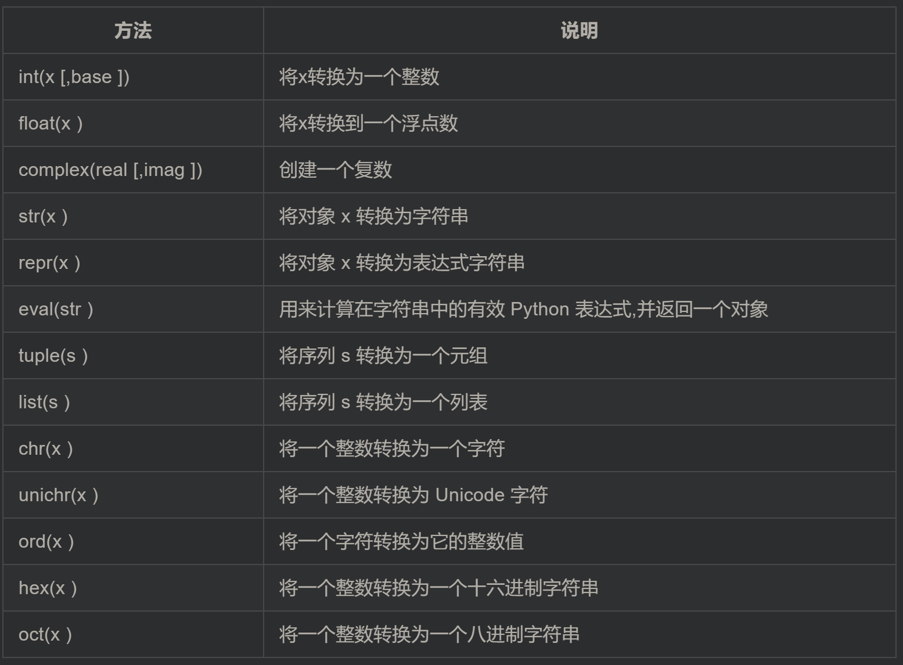

# Python

## 1. 概述

引号：自然语言使用双引号，机器标示使用单引号

空号：模块级函数和类定义之间空两行，类成员函数之间空一行

注释：文档注释以 """ 开头和结尾, 首行不换行, 如有多行, 末行必需换行

命名：常量采用全大写，函数名一律小写，模块尽量使用小写命名，类名使用驼峰(CamelCase)命名风格，首字母大写

## 2. 基本数据类型和变量

双引号中可以包含单引号，单引号类似

类型：`type(a)`

运算符：`**`, `//`(返回商的整数部分)

关系运算符：`and, or, not`

空值：`None`

UTF-8编码读取：`# -*- coding: utf-8 -*-`

基本的数据转换



多变量赋值：`a, b, c = 1, 2, "liangdianshui"`

## 3. List and Tuple

### 3.1 List

**方括号访问：**

```python
a = [1,2,3,4]
print(a[0:2])
```

结果是左开右闭，显示2个：[1,2]

**元素更新**：`name.append()`

**删除**：`del name[3]`

**列表运算符**：

**列表方法**：

### 3.2 Tuple

**创建**：`tuple=()`, `tuple=(123, )`, 如果不加逗号，创建出来的就不是 元组（tuple），而是指 `123` 这个数了

**删除**：`del tuple`

**元组运算符**：

## 4 DIct

**创建**：`dict = {key1 : value1, key2 : value2 }`

**修改**：

```python
dict1={'liangdianshui':'111111' ,'twowater':'222222' ,'两点水':'333333'}
# 新增
dict1['jack']='444444'
# 修改
dict1['liangdianshui']='555555'
```

**删除**

```python
# 通过 key 值，删除对应的元素
del dict1['twowater']
# 删除所有元素
dict1.clear()
#删除字典
del dict1
```

**遍历**

```python
animal = {'cat':1, 'dog':2, 'pig':3}

print('This is for values')
for number in animal.values():
	print(number,end=' ')
print(' ')

print('This is for keys')
for key in animal.keys():
	print(key,end=' ')
print(' ')

print('This is for items')
for key,number in animal.items():
    print(key+' : '+str(number))
```

**其他函数和方法**：


## 5 Set

**创建**：

使用set函数，将一个列表转换为集合 `set1=set([123,456,789])`

其中元素不允许重复，可以使用此特性将列表里重复元素去掉

**添加**：`set1.add(100)`

**删除**：`set1.remove(456)`

**运算**：

```python
# 交集
set3 = set1 & set2
# 并集
set3 = set1 | set2
#差集
set3 = set1 - set2
```

## 6. 控制语句

`range`函数: `range(n) = range(0,n)`，都是左开右闭；`range(0,10,2)`，表示每次递增2

