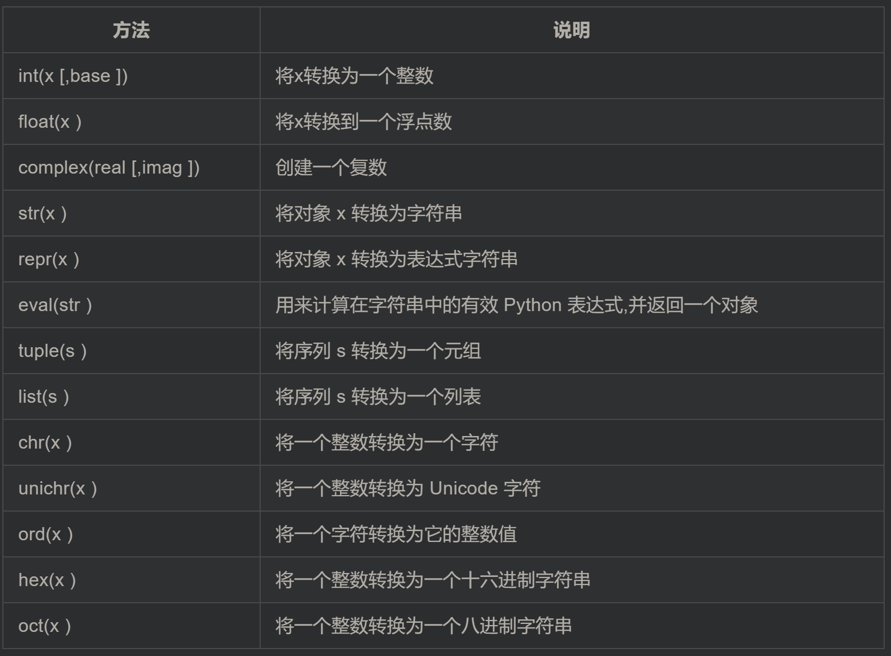

[TOC]

# Python

## 1. 概述

引号：自然语言使用双引号，机器标示使用单引号

空号：模块级函数和类定义之间空两行，类成员函数之间空一行

注释：文档注释以 """ 开头和结尾, 首行不换行, 如有多行, 末行必需换行

命名：常量采用全大写，函数名一律小写，模块尽量使用小写命名，类名使用驼峰(CamelCase)命名风格，首字母大写

## 2. 基本数据类型和变量

### 2.1 数据类型

双引号中可以包含单引号，单引号类似

类型：`type(a)`

运算符：`**`, `//`(返回商的整数部分)

关系运算符：`and, or, not`

空值：`None`

UTF-8编码读取：`# -*- coding: utf-8 -*-`

基本的数据转换



多变量赋值：`a, b, c = 1, 2, "liangdianshui"`

### 2.2 字符串

**编码**：

```python
>>> ord('A') # 把字符转换成对应的 Unicode 码
65
>>> ord('高')
39640
>>> chr(66) # 把十进制数字转换成对应的字符
'B'
>>> ord('淇')
28103
```

**替换**：

`newa = a.replace('c', 'b') `，可以将所有的元素c替换成为b，而原来的a并没有改变，只是将newa指向了一个新的变量

**切片**：


**分割与合并**：

将列表和字符串相互转换

```python
>>> a = "to be or not to be"
>>> a.split()
['to', 'be', 'or', 'not', 'to', 'be']
>>> a.split('be') # 指定分割符
['to ', ' or not to ', '']

>>> a = ['sxt','sxt100','sxt200']
>>> '*'.join(a)
'sxt*sxt100*sxt200'
```

我们可以直接使用`==, !=`对字符串进行比较，是否含有相同的字符。
我们使用 `is / not is`，判断两个对象是否同一个对象。比较的是对象的地址，即 `id(obj1)`是否和 `id(obj2)`相等。

**查找**：


**去除首尾信息**：

```python
>>> "*s*x*t*".strip("*")
's*x*t'
>>> "*s*x*t*".lstrip("*")
's*x*t*'
>>> "*s*x*t*".rstrip("*")
'*s*x*t'
>>> " sxt ".strip() # 去除空格
'sxt'
```


## 3. List and Tuple

### 3.1 List

**方括号访问：**

```python
a = [1,2,3,4]
print(a[0:2])
```

结果是左开右闭，显示2个：[1,2]

**元素更新**：`name.append()`

**删除**：`del name[3]`

**列表运算符**：

**列表方法**：

### 3.2 Tuple

**创建**：`tuple=()`, `tuple=(123, )`, 如果不加逗号，创建出来的就不是 元组（tuple），而是指 `123` 这个数了

**删除**：`del tuple`

**元组运算符**：

## 4 Dict

**创建**：`dict = {key1 : value1, key2 : value2 }`

**修改**：

```python
dict1={'liangdianshui':'111111' ,'twowater':'222222' ,'两点水':'333333'}
# 新增
dict1['jack']='444444'
# 修改
dict1['liangdianshui']='555555'
```

**删除**

```python
# 通过 key 值，删除对应的元素
del dict1['twowater']
# 删除所有元素
dict1.clear()
#删除字典
del dict1
```

**遍历**

```python
animal = {'cat':1, 'dog':2, 'pig':3}

print('This is for values')
for number in animal.values():
	print(number,end=' ')
print(' ')

print('This is for keys')
for key in animal.keys():
	print(key,end=' ')
print(' ')

print('This is for items')
for key,number in animal.items():
    print(key+' : '+str(number))
```

**其他函数和方法**：


## 5 Set

**创建**：

使用set函数，将一个列表转换为集合 `set1=set([123,456,789])`

其中元素不允许重复，可以使用此特性将列表里重复元素去掉

**添加**：`set1.add(100)`

**删除**：`set1.remove(456)`

**运算**：

```python
# 交集
set3 = set1 & set2
# 并集
set3 = set1 | set2
#差集
set3 = set1 - set2
```

## 6. 控制语句

`range`函数: `range(n) = range(0,n)`，都是左开右闭；`range(0,10,2)`，表示每次递增2

## 7. print函数

### 7.1 %用法

```python
"""整数"""
print('%o' %20) # 八进制
# %d, %x

"""浮点数"""
print('%.3f', %1.11) # 保留3位小数，默认6位
print('%e', %1.11) # 科学计数法
print('%.7g', %1.11) # 有效数字

"""round函数"""
round(1.1123) # 四舍五入

"""字符串"""
print('%10s', %'Hello') # 右对齐
print('%-10s', %'Hello') # 左对齐
```

### 7.2 format函数

```python
>>> print('{} {}'.format('hello','world'))  # 不带字段
hello world
>>> print('{0} {1}'.format('hello','world'))  # 带数字编号
hello world
>>> print('{0} {1} {0}'.format('hello','world'))  # 打乱顺序
hello world hello
>>> print('{1} {1} {0}'.format('hello','world'))
world world hello
>>> print('{a} {tom} {a}'.format(tom='hello',a='world'))  # 带关键字
world hello world
```

< （默认）左对齐、> 右对齐、^ 中间对齐、= （只用于数字）在小数点后进行补齐

取位数“{:4s}”、"{:.2f}"等

```python
print('{0} is {0:>10.2f}'.format(1.123))
# 取2位小数，10位右对齐，前面0表示format中元素序号
'{:*^30}'.format('centered')  # 使用“*”填充
```

## 8. 函数

**实例：**

```python
def functionname( parameters ):
   "函数_文档字符串"
   function_suite
   return [expression]
```

**返回值**：Python 一次接受多个返回值的数据类型就是元组

### 8.1 参数

默认参数：**只有在形参表末尾的那些参数可以有默认参数值**

```python
def print_name(name, age=18)
	print(name+": "+str(age))
	
print_name('wgt')
print_name('吴国桐',21)
```

关键字参数：可以通过参数名来给函数传递参数，而不用关心参数列表定义时的顺序

```python
def print_user_info( name ,  age  , sex = '男' ):
   pass

print_user_info( name = '两点水' ,age = 18 , sex = '女')
print_user_info( name = '两点水' ,sex = '女', age = 18 )
```

不定长参数：

无法确定传入的参数个数

```python
def print_user_info( name ,  age  , sex = '男' , * hobby):
	# hobby其实是一个元组
    pass

print_user_info( '两点水' ,18 , '女', '打篮球','打羽毛球','跑步')
```

可变长参数也支持关键字参数（位置参数），没有被定义的关键参数会被放到一个字典里。

```python
def print_user_info( name ,  age  , sex = '男' , ** hobby ):
    pass

print_user_info( name = '两点水' , age = 18 , sex = '女', hobby = ('打篮球','打羽毛球','跑步'))
```

只接受关键字参数: 将强制关键字参数放到某个`*`参数或者单个`*`后面

```python
def print_user_info( name , *, age  , sex = '男' ):
    pass

print_user_info( name = '两点水' ,age = 18 , sex = '女' )
# 这种写法会报错，因为 age ，sex 这两个参数强制使用关键字参数
# print_user_info( '两点水' , 18 , '女' )
```

### 8.2 函数传值

**不可更改的类型**：类似 c++ 的值传递，如 整数、字符串、元组。如fun（a），传递的只是 a 的值，没有影响 a 对象本身。比如在 fun（a）内部修改 a 的值，只是修改另一个复制的对象，不会影响 a 本身。

**可更改的类型**：类似 c++ 的引用传递，如 列表，字典。如 fun（a），则是将 a 真正的传过去，修改后 fun 外部的 a 也会受影响

### 8.3 匿名函数

```python
sum = lambda num1 , num2 : num1 + num2;
```

## 9. 迭代器

[iter.py](iter.py)

### 9.1 迭代方法创建list

```python
list1 = [x*x for x in range(1,11)]

# 后面带if形式
list1 = [x*x for x in range(1,11) if x % 2 == 0]

# 嵌套for
list1= [(x+1,y+1) for x in range(3) for y in range(5)]
```

### 9.2 生成器

[yiled.py](yiled.py)

```python
def odd():
    print ( 'step 1' )
    yield ( 1 )
    print ( 'step 2' )
    yield ( 3 )
    print ( 'step 3' )
    yield ( 5 )

o = odd()
print( next( o ) )
print( next( o ) )
print( next( o ) )
```

### 9.3 反向迭代

反向迭代仅仅当对象的大小可预先确定，或者对象实现了 `__reversed__()` 的特殊方法时才能生效。 如果两者都不符合，那你必须先将对象转换为一个列表才行

```python
list1 = [1,2,3,4,5]
for num1 in reversed(list1) :
    print ( num1 , end = ' ' )
```

### 9.4 同时迭代多个序列

zip(a, b) 会生成一个可返回元组 (x, y) 的迭代器，其中 x 来自 a，y 来自 b。 一旦其中某个序列到底结尾，迭代宣告结束。

```python
names = ['laingdianshui', 'twowater', '两点水']
ages = [18, 19, 20]
for name, age in zip(names, ages):
     print(name,age)
```

利用 `zip()` 函数，我们还可把一个 key 列表和一个 value 列表生成一个 dict （字典）

```python
names = ['laingdianshui', 'twowater', '两点水']
ages = [18, 19, 20]

dict1= dict(zip(names,ages))
```

## 10. 面向对象

### 10.1 定义类

```python
class ClassA():
    var1 = 100
    var2 = 0.01
    var3 = '两点水'

    '''
    下面是实例方法
    通过实例调用：
    a = ClassA()
    a.fun1()
    '''
    
    def fun1():
        print('我是 fun1')

    def fun2():
        print('我是 fun1')

    def fun3():
        print('我是 fun1')
```

### 10.2 类方法

```python
class ClassA():
    var1 = 'wgt'
    
    '''
    下面是类方法
    通过类名来调用:
    ClassA.fun1(age)
    '''
    @classmethod # 声明下面的函数是类函数
    def fun1(cls,age): #方法参数中有cls，需要通过cls获取到类属性
        print('I am' + cls.var1) # cls同样不能省略
        print(cls.var1 + 'is' + str(age))
```

### 10.3 实例

类属性改变了，实例属性会跟着改变

类方法改变了，实例方法也是会跟着改变的

改变类方法，`类.原始函数 = 新函数` ，完成类的重写了，注意没有括号

### 10.4 初始化函数

```python
class ClassA(object): # 继承object类
	
    # 构造函数？
    def __init__(self, [...]): # 第一个参数一定要写上 self
        pass
    
    # 析构函数
    def __del__(self, [...]):
        pass
```

### 10.5 类的继承

[inheritance.py](inheritance.py)

类型的判断：

```python
isinstance(123, int)
# 输出bool值
```

### 10.6 多态

[polymorfic.py](polymorfic.py)

### 10.7 类的访问控制

```python
def __init__(self, name, age, account):
    # 可以公开访问
    self.name = name
    # 编程规范的私有变量，仍然可以访问
    self._age = age
    # 仍然有办法访问？
    self.__account = account
```

类的专有方法：

- `type(obj)`：来获取对象的相应类型；
- `isinstance(obj, type)`：判断对象是否为指定的 type 类型的实例；
- `hasattr(obj, attr)`：判断对象是否具有指定属性/方法；
- `getattr(obj, attr[, default])` 获取属性/方法的值, 要是没有对应的属性则返回 default 值（前提是设置了 default），否则会抛出 AttributeError 异常；
- `setattr(obj, attr, value)`：设定该属性/方法的值，类似obj.attr=value；
- `dir(obj)`：可以获取相应对象的所有属性和方法名的列表：

方法的访问控制与属性相同

## 11 模块

### 11.1 模块的使用

```python
import xx
```

当使用import语句时，python从搜索路径依次寻找

```python
import sys
print(sys.path)
```

直接导入某个模块中的某一个功能，也就是属性和方法

```python
import sys
# 下面只能写作
print(sys.version)

from sys import version
# 可以直接使用
print(version)

# 甚至可以直接写作
from sys import *
```

### 11.2 主模块和非主模块

如果一个模块被直接使用，而没有被别人调用，我们称这个模块为主模块，如果一个模块被别人调用，我们称这个模块为非主模块。

可以通过`if name == '__main__'`判断是否存在调用

### 11.3 包

每个包目录下面都有一个`__init__.py`，其对应的模块名就是它的包名

### 11.4 作用域

```python
#!/usr/bin/env python3
# -*- coding: UTF-8 -*-

def _diamond_vip(lv):
    print('尊敬的钻石会员用户，您好')
    vip_name = 'DiamondVIP' + str(lv)
    return vip_name


def _gold_vip(lv):
    print('尊敬的黄金会员用户，您好')
    vip_name = 'GoldVIP' + str(lv)
    return vip_name


def vip_lv_name(lv):
    if lv == 1:
        print(_gold_vip(lv))
    elif lv == 2:
        print(_diamond_vip(lv))


vip_lv_name(2)
```

在这个模块中，我们公开 `vip_lv_name` 方法函数，而其他内部的逻辑分别在 `_diamond_vip` 和 `_gold_vip` private 函数中实现

## 12. Python 的 Magic Method（待补充理解）

使用`dir(object)`列举出所有的魔术方法

`__new__` 是用来创建类并返回这个类的实例?

```python
class Meter(object):
    def __init__(self, value=0.0):
        self.value = float(value)

    def __get__(self, instance, owner):
        return self.value

    def __set__(self, instance, value):
        self.value = float(value)


class Foot(object):
    def __get__(self, instance, owner):
        return instance.meter * 3.2808

    def __set__(self, instance, value):
        instance.meter = float(value) / 3.2808


class Distance(object):
    meter = Meter()
    foot = Foot()
    
if __name__ == '__main__':
    d = Distance()
    print(d.meter, d.foot)
    d.meter = 1
    print(d.meter, d.foot)
    d.meter = 2
    print(d.meter, d.foot)
    
    
# ====================输出结果======================
0.0 0.0
1.0 3.2808
2.0 6.5616
```

运算符的魔术方法，相当于重载

```python
class Number(object):
    def __init__(self, value):
        self.value = value

    def __eq__(self, other):
        print('__eq__')
        return self.value == other.value

    def __ne__(self, other):
        print('__ne__')
        return self.value != other.value

    def __lt__(self, other):
        print('__lt__')
        return self.value < other.value

    def __gt__(self, other):
        print('__gt__')
        return self.value > other.value

    def __le__(self, other):
        print('__le__')
        return self.value <= other.value

    def __ge__(self, other):
        print('__ge__')
        return self.value >= other.value


if __name__ == '__main__':
    num1 = Number(2)
    num2 = Number(3)
    print('num1 == num2 ? --------> {} \n'.format(num1 == num2))
    print('num1 != num2 ? --------> {} \n'.format(num1 == num2))
    print('num1 < num2 ? --------> {} \n'.format(num1 < num2))
    print('num1 > num2 ? --------> {} \n'.format(num1 > num2))
    print('num1 <= num2 ? --------> {} \n'.format(num1 <= num2))
    print('num1 >= num2 ? --------> {} \n'.format(num1 >= num2))
```

## 13. 枚举类

```python
from enum import Enum
Month = Enum('Month', ('Jan', 'Feb', 'Mar', 'Apr', 'May', 'Jun', 'Jul', 'Aug', 'Sep', 'Oct', 'Nov', 'Dec'))

#第一个参数 Month 表示的是该枚举类的类名，第二个 tuple 参数，表示的是枚举类的值

for name, member in Month.__members__.items():
    print(name, '---------', member, '----------', member.value)
```

`member.value` 是自动赋给成员的 `int` 类型的常量，默认是从 1 开始的

`MappingProxyType`不可改变的字典映射

```python
from types import MappingProxyType

d = {'a':1, 'b':2}
d_view = MappingProxyType(d)
# d_view的映射不可改变
```

如果需要自定义字典的映射，即改变上述从Jan->1的映射，可以采用派生的方法

```python
# @unique 装饰器可以帮助我们检查保证没有重复值
@unique
class Month(Enum):
    Jan = 'January'
    Feb = 'February'
    Mar = 'March'
    Apr = 'April'
    May = 'May'
    Jun = 'June'
    Jul = 'July'
    Aug = 'August'
    Sep = 'September '
    Oct = 'October'
    Nov = 'November'
    Dec = 'December'
    
# 遍历方法与上述一致
```

枚举的比较